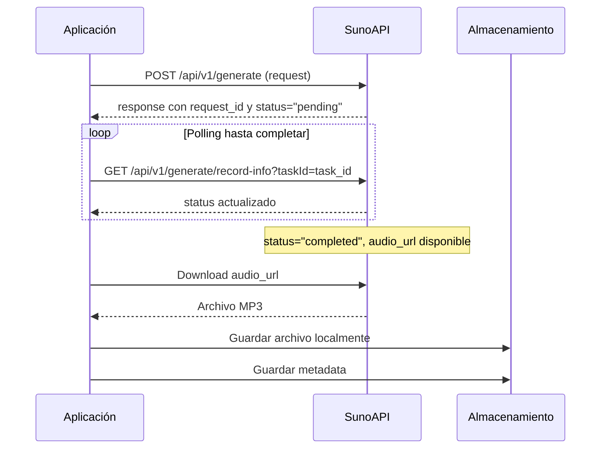

# Referencia de API - SunoAPI Integration

## Configuración de la API

### Variables de Entorno

```bash
SUNO_API_KEY=tu_api_key_aqui          # Requerido
SUNO_BASE_URL=https://api.sunoapi.org # Opcional (por defecto)
REQUEST_TIMEOUT=30                    # Opcional (segundos)
```

### Obtener API Key

1. Visita https://sunoapi.org/api-key
2. Registra una cuenta
3. Genera tu API key
4. Añádela al archivo `.env`

## Endpoints Utilizados

### 1. Generate Music
**URL**: `POST /api/v1/generate`

#### Request
```json
{
  "prompt": "Letra de la canción o descripción",
  "style": "rock, pop, jazz, etc.",
  "title": "Título de la canción",
  "model": "V3_5 | V4 | V4_5",
  "customMode": true | false,
  "instrumental": true | false,
  "callBackUrl": "https://your-callback-url.com/webhook"
}
```

#### Response
```json
{
  "code": 200,
  "msg": "success",
  "data": {
    "taskId": "5c79****be8e"
  }
}
```

### 2. Get Generation Status
**URL**: `GET /api/v1/generate/record-info?taskId=task_id`

#### Response
```json
{
  "code": 200,
  "msg": "success",
  "data": {
    "taskId": "5c79****be8e",
    "status": "SUCCESS",
    "response": {
      "sunoData": [
        {
          "id": "8551****662c",
          "audioUrl": "https://example.cn/****.mp3",
          "title": "Título de la canción",
          "duration": 198.44
        }
      ]
    }
  }
}
```

## Modelos Disponibles

### V3.5 (Balanced)
- **Descripción**: Arreglos sólidos con diversidad creativa
- **Duración**: Variable
- **Mejor para**: Uso general, experimentación

### V4 (High Quality)
- **Descripción**: Mejor calidad de audio con estructura refinada
- **Duración**: Mayor que V3.5
- **Mejor para**: Producciones de alta calidad

### V4.5 (Advanced)
- **Descripción**: Mezcla superior de géneros con prompts inteligentes
- **Duración**: La más larga
- **Mejor para**: Composiciones complejas, múltiples géneros

## Flujo de Generación



## Límites y Restricciones

### Rate Limits
- **Concurrencia**: Máximo 20 requests por 10 segundos
- **Generación**: Cada request genera 2 canciones
- **Timeout**: 30-40 segundos para stream_url, 2-3 minutos para audio_url

### Retención
- **Archivos**: Se mantienen 15 días en servidores de Suno
- **Recomendación**: Descargar inmediatamente tras generación

### Tamaños
- **Prompt**: Límite de caracteres (verificar documentación actualizada)
- **Title**: Límite de caracteres
- **Style**: Texto libre, pero conciso es mejor

## Implementación en el Código

### SunoAPIClient

```python
class SunoAPIClient(MusicGeneratorPort):
    def __init__(self, api_key: str, base_url: str = "https://api.sunoapi.org"):
        self.api_key = api_key
        self.base_url = base_url
        self.headers = {
            "Authorization": f"Bearer {api_key}",
            "Content-Type": "application/json"
        }
```

### Métodos Principales

#### generate_music()
```python
async def generate_music(self, request: SongRequest) -> SongResponse:
    url = f"{self.base_url}/api/v1/generate"
    payload = request.to_dict()
    
    async with aiohttp.ClientSession() as session:
        async with session.post(url, json=payload, headers=self.headers) as response:
            # Manejo de respuesta y errores
            return self._parse_response(data)
```

#### get_generation_status()
```python
async def get_generation_status(self, request_id: str) -> SongResponse:
    url = f"{self.base_url}/api/v1/generate/record-info"
    params = {"taskId": request_id}
    
    async with aiohttp.ClientSession() as session:
        async with session.get(url, params=params, headers=self.headers) as response:
            # Verificar estado de generación
            return self._parse_response(data[0])
```

#### download_track()
```python
async def download_track(self, audio_url: str, output_path: str) -> bool:
    async with aiohttp.ClientSession() as session:
        async with session.get(audio_url) as response:
            if response.status == 200:
                with open(output_path, 'wb') as f:
                    async for chunk in response.content.iter_chunked(8192):
                        f.write(chunk)
                return True
```

## Manejo de Errores

### Errores Comunes

#### 401 Unauthorized
```json
{
  "error": "Invalid API key"
}
```
**Solución**: Verificar API key en `.env`

#### 429 Too Many Requests
```json
{
  "error": "Rate limit exceeded"
}
```
**Solución**: Implementar backoff exponencial

#### 500 Internal Server Error
```json
{
  "error": "Internal server error"
}
```
**Solución**: Reintentar después de delay

### Implementación de Retry

```python
import asyncio
from typing import Optional

async def with_retry(
    operation: callable,
    max_retries: int = 3,
    delay: float = 1.0
) -> Optional[any]:
    for attempt in range(max_retries):
        try:
            return await operation()
        except aiohttp.ClientError as e:
            if attempt == max_retries - 1:
                raise
            await asyncio.sleep(delay * (2 ** attempt))  # Backoff exponencial
```

## Configuración Recomendada

### Para Desarrollo
```python
settings = Settings(
    suno_api_key="tu_key_desarrollo",
    request_timeout=60,  # Mayor timeout para debug
    max_concurrent_requests=1  # Una a la vez para debug
)
```

### Para Producción
```python
settings = Settings(
    suno_api_key="tu_key_produccion",
    request_timeout=30,
    max_concurrent_requests=5,
    suno_base_url="https://api.sunoapi.org"  # URL oficial
)
```

## Monitoreo y Logging

### Logs Recomendados

```python
import logging

logger = logging.getLogger(__name__)

# En generate_music()
logger.info(f"Iniciando generación: {request.title}")
logger.debug(f"Payload: {payload}")

# En get_generation_status()
logger.info(f"Checking status for {request_id}: {response.status}")

# En download_track()
logger.info(f"Descargando: {audio_url} -> {output_path}")
```

### Métricas Útiles

- Tiempo total de generación
- Tasa de éxito/fallo por modelo
- Tamaño promedio de archivos generados
- Uso de cuota de API

## Extensiones Futuras

### Múltiples Proveedores

```python
class MusicProviderFactory:
    @staticmethod
    def create(provider: str, config: dict) -> MusicGeneratorPort:
        if provider == "suno":
            return SunoAPIClient(config["api_key"])
        elif provider == "openai":
            return OpenAIMusicClient(config["api_key"])
        elif provider == "elevenlabs":
            return ElevenLabsClient(config["api_key"])
        else:
            raise ValueError(f"Unknown provider: {provider}")
```

### Configuración por Modelo

```python
@dataclass
class ModelConfig:
    version: ModelVersion
    max_duration: int
    quality_level: str
    style_flexibility: float

class AdvancedSongRequest(SongRequest):
    model_config: ModelConfig
    generation_options: dict
```