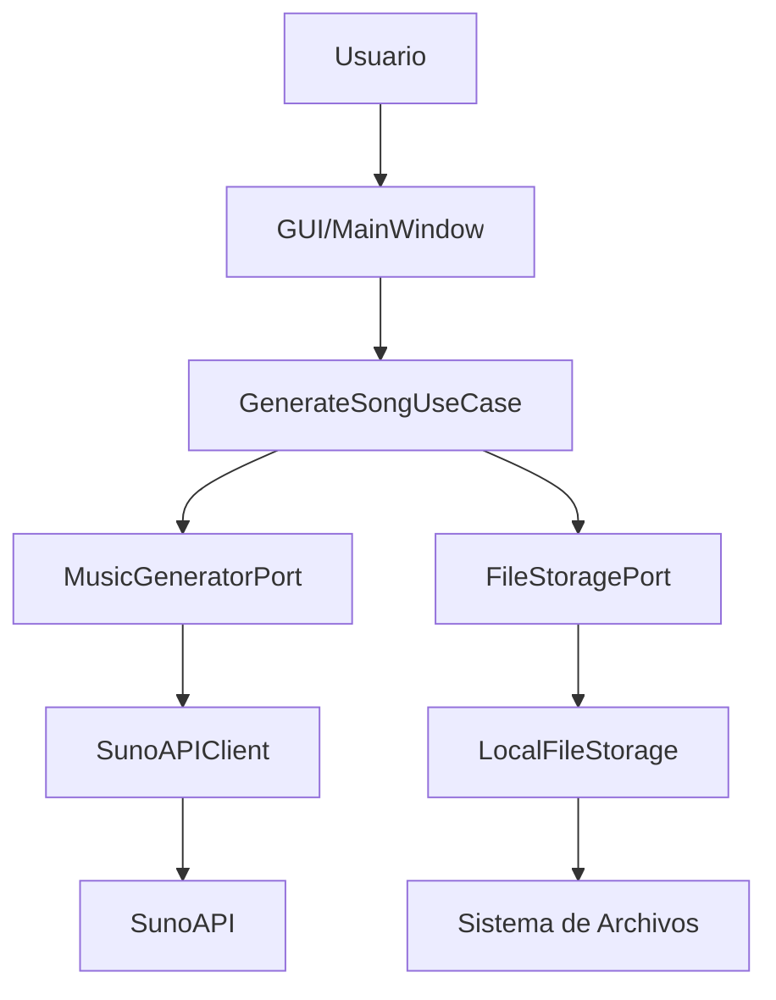

# Arquitectura del Sistema

## Visión General

VideoMusic Generator implementa una **Arquitectura Hexagonal** (también conocida como Ports and Adapters) que separa la lógica de negocio de los detalles de implementación externos.

## Capas de la Arquitectura

### 1. Domain (Dominio)
**Ubicación**: `src/domain/`

Es el núcleo de la aplicación, contiene las reglas de negocio puras sin dependencias externas.

#### Entities (Entidades)
- `SongRequest`: Representa una petición de generación musical
- `SongResponse`: Respuesta de la API con información de tracks
- `SongTrack`: Información individual de cada pista generada
- `GenerationSession`: Sesión completa de generación con metadatos

#### Ports (Puertos)
Interfaces que definen contratos para servicios externos:
- `MusicGeneratorPort`: Generación de música
- `FileStoragePort`: Almacenamiento de archivos

### 2. Application (Aplicación)
**Ubicación**: `src/application/`

Contiene los casos de uso que orquestan la lógica de negocio.

#### Use Cases (Casos de Uso)
- `GenerateSongUseCase`: Proceso completo de generación de canciones
- `ListSessionsUseCase`: Gestión del historial de sesiones

### 3. Infrastructure (Infraestructura)
**Ubicación**: `src/infrastructure/`

Implementaciones concretas de los puertos definidos en el dominio.

#### Adapters (Adaptadores)
- `SunoAPIClient`: Cliente para la API de Suno
- `LocalFileStorage`: Almacenamiento en sistema de archivos local

#### Config (Configuración)
- `Settings`: Gestión de configuración y variables de entorno

### 4. Presentation (Presentación)
**Ubicación**: `src/presentation/`

Interfaz de usuario y adaptadores de entrada.

#### GUI (Interfaz Gráfica)
- `MainWindow`: Ventana principal con tkinter

## Flujo de Datos



## Principios SOLID Aplicados

### Single Responsibility Principle (SRP)
- **SongRequest**: Solo maneja datos de petición
- **SunoAPIClient**: Solo se comunica con la API
- **LocalFileStorage**: Solo maneja archivos locales
- **GenerateSongUseCase**: Solo orquesta la generación

### Open/Closed Principle (OCP)
- Nuevos adaptadores pueden añadirse sin modificar código existente
- Nuevos casos de uso extienden funcionalidad sin cambios

### Liskov Substitution Principle (LSP)
- Cualquier implementación de `MusicGeneratorPort` es intercambiable
- `FileStoragePort` puede ser reemplazado por implementaciones en BD

### Interface Segregation Principle (ISP)
- Puertos específicos y cohesivos
- No hay métodos innecesarios en las interfaces

### Dependency Inversion Principle (DIP)
- Casos de uso dependen de abstracciones (puertos)
- Implementaciones concretas se inyectan desde exterior

## Patrones de Diseño Utilizados

### Repository Pattern
- `FileStoragePort` actúa como repositorio para sesiones
- Abstrae el almacenamiento de datos

### Factory Pattern
- `GenerationSession.create_new()` crea nuevas sesiones
- `Settings.from_env()` crea configuración desde entorno

### Observer Pattern
- Callbacks de progreso en `GenerateSongUseCase`
- Actualización de UI en tiempo real

### Adapter Pattern
- `SunoAPIClient` adapta la API externa al dominio
- `LocalFileStorage` adapta el sistema de archivos

## Ventajas de la Arquitectura

### Mantenibilidad
- Separación clara de responsabilidades
- Código organizado y fácil de entender
- Cambios localizados sin efectos colaterales

### Testabilidad
- Dominio puro sin dependencias externas
- Puertos facilitan el uso de mocks
- Tests unitarios independientes

### Escalabilidad
- Fácil adición de nuevas funcionalidades
- Intercambio de implementaciones sin cambios
- Preparado para separación frontend/backend

### Flexibilidad
- Múltiples interfaces de usuario posibles
- Soporte para diferentes APIs de música
- Varios sistemas de almacenamiento

## Preparación para Escalado

### Separación Frontend/Backend

#### Backend API
```
backend/
├── api/
│   ├── routes/
│   │   ├── songs.py           # Endpoints de canciones
│   │   └── sessions.py        # Endpoints de sesiones
│   ├── middleware/
│   │   ├── auth.py            # Autenticación
│   │   └── cors.py            # CORS
│   └── main.py                # FastAPI app
├── src/                       # Reutilizar lógica existente
└── docker/
    └── Dockerfile
```

#### Múltiples Frontends
```
frontend/
├── web/                       # React/Vue/Angular
├── mobile/                    # React Native/Flutter
├── desktop/                   # Electron/Tauri
└── cli/                       # Cliente CLI
```

### Nuevas Funcionalidades

#### Generación de Video
```python
# Nuevo puerto
class VideoGeneratorPort(ABC):
    @abstractmethod
    async def generate_video(self, audio_path: str, config: VideoConfig) -> VideoResponse:
        pass

# Nuevo caso de uso
class GenerateVideoMusicUseCase:
    def __init__(self, music_gen: MusicGeneratorPort, video_gen: VideoGeneratorPort):
        self.music_gen = music_gen
        self.video_gen = video_gen
    
    async def execute(self, request: VideoMusicRequest) -> VideoMusicSession:
        # 1. Generar música
        # 2. Generar video
        # 3. Combinar audio y video
        pass
```

#### Múltiples Proveedores
```python
# Adaptadores adicionales
class OpenAIMusicClient(MusicGeneratorPort):
    pass

class GoogleMusicClient(MusicGeneratorPort):
    pass

# Factory para proveedores
class MusicProviderFactory:
    @staticmethod
    def create(provider: str, config: dict) -> MusicGeneratorPort:
        if provider == "suno":
            return SunoAPIClient(config["api_key"])
        elif provider == "openai":
            return OpenAIMusicClient(config["api_key"])
        # ...
```

#### Base de Datos
```python
# Nueva implementación del puerto
class DatabaseStorage(FileStoragePort):
    def __init__(self, db_connection):
        self.db = db_connection
    
    def save_metadata(self, session: GenerationSession) -> bool:
        # Guardar en BD en lugar de archivos JSON
        pass
```

## Decisiones de Diseño

### ¿Por qué Arquitectura Hexagonal?
- **Independencia**: Lógica de negocio independiente de frameworks
- **Testabilidad**: Facilita testing unitario y de integración
- **Flexibilidad**: Permite cambiar tecnologías sin afectar el core
- **Mantenibilidad**: Estructura clara y predecible

### ¿Por qué Python y Tkinter?
- **Simplicidad**: Una sola tecnología para todo el stack
- **Multiplataforma**: Funciona en Windows, Mac y Linux
- **Sin instalación**: Tkinter viene incluido con Python
- **Prototipado rápido**: Desarrollo ágil de MVP

### ¿Por qué Asyncio?
- **No bloqueo**: UI responsiva durante generación
- **Eficiencia**: Manejo concurrente de requests HTTP
- **Escalabilidad**: Preparado para múltiples operaciones simultáneas

## Diagramas

### Diagrama de Componentes
```
┌─────────────────────────────────────────────────────────┐
│                    Presentation                         │
│  ┌─────────────────────────────────────────────────┐   │
│  │              MainWindow (Tkinter)               │   │
│  └─────────────────────────────────────────────────┘   │
└─────────────────────────────────────────────────────────┘
                           │
                           ▼
┌─────────────────────────────────────────────────────────┐
│                    Application                          │
│  ┌─────────────────┐    ┌─────────────────────────────┐ │
│  │ GenerateSongUC  │    │     ListSessionsUC          │ │
│  └─────────────────┘    └─────────────────────────────┘ │
└─────────────────────────────────────────────────────────┘
                           │
                           ▼
┌─────────────────────────────────────────────────────────┐
│                      Domain                             │
│  ┌──────────────┐  ┌──────────────┐  ┌────────────────┐ │
│  │   Entities   │  │    Ports     │  │  Value Objects │ │
│  └──────────────┘  └──────────────┘  └────────────────┘ │
└─────────────────────────────────────────────────────────┘
                           │
                           ▼
┌─────────────────────────────────────────────────────────┐
│                  Infrastructure                         │
│  ┌─────────────────┐    ┌─────────────────────────────┐ │
│  │  SunoAPIClient  │    │    LocalFileStorage         │ │
│  └─────────────────┘    └─────────────────────────────┘ │
└─────────────────────────────────────────────────────────┘
```

### Diagrama de Flujo de Generación
```
Usuario ingresa datos → GUI valida → UseCase ejecuta
                                           │
                    ┌─────────────────────────┴──────────────────────────┐
                    ▼                                                    ▼
            SunoAPIClient                                      FileStorage
                    │                                                    │
                    ▼                                                    ▼
            Generar música                                      Guardar metadata
                    │                                                    │
                    ▼                                                    ▼
            Monitorear estado                                   Crear directorio
                    │                                                    │
                    ▼                                                    ▼
            Descargar archivos ──────────────────────────────────────────┘
                    │
                    ▼
            Notificar completion → GUI actualiza
```